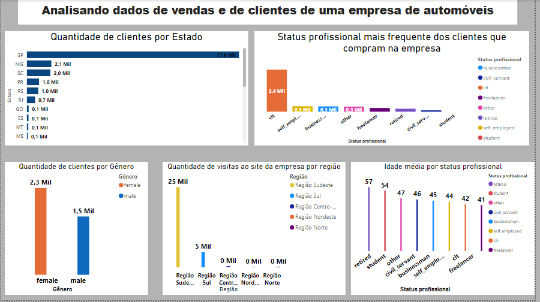

# Analisando-dados-de-vendas-e-clientes

# 1. Introdução

O objetivo deste projeto é conectar o python ao postgreSQL e acessar o banco de dados que contém as tabelas relacionadas a uma empresa de automóveis diretamente do python no jupyter notebook. A ideia é fazer as análises utilizando os códigos do SQL no Python pelo jupyter notebook e as bibliotecas do python. Sendo assim, a filtragem dos dados foi feita utilizando os códigos do  postgreSQL aqui no python e a geração dos gráficos foi feita utilizando as bibliotecas do python. Além disso, com os dados filtrados foi elaborado um dashboard no Excel e no Power BI. A análise consiste em responder as seguintes perguntas:

**1**. **Qual Estado possue mais clientes?**

**2**. **Qual o status profissional mais frequente dos clientes que compraram automóveis no site?**

**3**. **Quem compra mais, homens ou mulheres?**

**4**. **Qual região possui o maior número de clientes que visitam o site da empresa?**

**5**. **Qual a idade média dos clientes por status profissional?**

Sendo assim, o projeto foi dividido da seguinte maneira:

**1**. **Importação das bibliotecas utilizadas ao longo de todo o projeto.**

**2**. **Coleta de dados usando os códigos postgreSQL.**

**2.1** **Conectando ao banco de dados no postgreSQL.**

**2.2** **Consultando as tabelas existentes no banco de dados no PostegreSQL.**

**2.2.1** **Tabela com informações dos clientes.**

**2.2.2** **Tabela com informações dos produtos.**

**2.2.3** **Tabela com informações das lojas.**

**2.2.4** **Tabela com informações das regiões de vendas.**

**3**. **Analisando os dados.**

# 2. Resumo das tabelas das tabelas consultadas no banco de dados no PostegreSQL

OBSERVAÇÃO: Para visualziar as tabelas por completo, é preciso acessar o arquivo, pois são muitas linhas. Aqui é só para termos uma noção do tipo de informação que consta nessa tabela.

## 2.1 Tabela com informações dos clientes

## 2.2 Tabela com informações dos produtos

## 2.3 Tabela com informações das lojas

## 2.4 Tabela com informações das regiões de vendas

# 3. Analisando os dados com SQL conectado ao Python

**1**. **Qual Estado possue mais clientes?**

**2**. **Qual o status profissional mais frequente dos clientes que compraram automóveis no site?**

**3**. **Quem compra mais, homens ou mulheres?**

**4**. **Qual região possui o maior número de clientes que visitam o site da empresa?**

**5**. **Qual a idade média dos clientes por status profissional?**

## 1. Qual Estado possue mais clientes?

* O Estado com o maior número de clientes é São Paulo com 17864.

## 2. Qual o status profissional mais frequente dos clientes que compraram automóveis no site?

* Os clientes que mais compram são trabalhadores da modalidade CLT.

## 3. Quem compra mais, homens ou mulheres?

* A maioria dos clientes são do sexo feminino.
   
## 4. Qual região possui o maior número de clientes que visitam o site da empresa?

* A região que possui o maior número de clientes que visitam o site da empresa é a região Sudeste.

## 5.Qual a idade média dos clientes por status profissional?

* Clientes aposentados possuem a maior idade. Contudo, um fato interessante nessa base de dados é que em segundo lugar, está a categoria estudante com a maior idade média.

# 4. Analisando os dados com SQL e Excel

# 5. Analisando os dados com SQL e Power BI

# 6. Conclusões
* O Estado com o maior número de clientes é São Paulo com 17864.

* Os clientes que mais compram são trabalhadores da modalidade CLT.

* A maioria dos clientes são do sexo feminino.

* A região que possui o maior número de clientes que visitam o site da empresa é a região Sudeste.

* Clientes aposentados possuem a maior idade. Contudo, um fato interessante nessa base de dados é que em segundo lugar, está a categoria estudante com a maior idade média.
